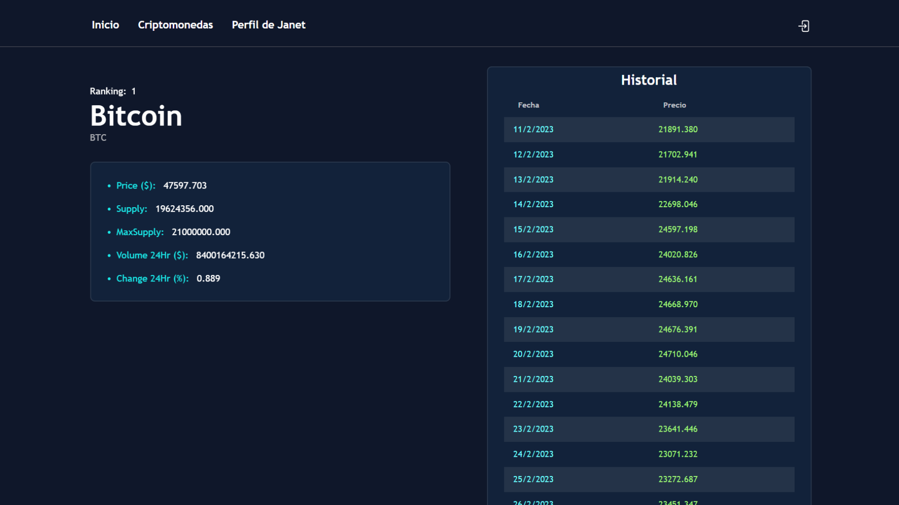

# Cripto Demo

## Descripción
Cripto Demo es un proyecto desarrollado como práctica utilizando React. Proporciona una aplicación web que simula un sistema de criptomonedas, con funcionalidades básicas como inicio de sesión, visualización de criptomonedas, detalles de criptomoneda y perfil de usuario.

## Tecnologías utilizadas
- React: Una biblioteca de JavaScript para construir interfaces de usuario.
- Vite: Un entorno de desarrollo rápido para React.
- Yarn: Un gestor de paquetes para administrar las dependencias del proyecto.

## Funcionalidades
- **Inicio de sesión:** El usuario puede iniciar sesión utilizando las credenciales de prueba proporcionadas.
- **Bienvenida:** Después del inicio de sesión, se muestra una página de bienvenida.
- **Lista de criptomonedas:** Se presenta una lista de criptomonedas disponibles.
- **Detalles de la criptomoneda:** Los usuarios pueden hacer clic en un enlace para ver más detalles sobre cada criptomoneda.
- **Perfil de usuario:** Existe un perfil predefinido para un usuario de prueba.
- **Cerrar sesión:** Los usuarios pueden cerrar sesión en cualquier momento.

## Instrucciones de instalación
1. Clona este repositorio en tu máquina local.
2. Abre una terminal en la carpeta del proyecto.
3. Ejecuta el comando `yarn install` para instalar las dependencias.
4. Ejecuta el comando `yarn dev` para iniciar el servidor de desarrollo.
5. Abre tu navegador y visita `http://localhost:5173` para ver la aplicación.

## Notas adicionales
- Este proyecto es solo con fines educativos y de práctica.
- Los datos utilizados en la aplicación son ficticios y no representan datos reales de criptomonedas.

## Enlace de la aplicación
[Enlace a la aplicación en línea](https://cripto-demo-react.vercel.app)
[Enlace a la api Coincap](https://docs.coincap.io/)
[Enlace a la api Reqres](https://reqres.in/)

## Contribución
Siéntete libre de contribuir con mejoras o nuevas características. ¡Toda ayuda es bienvenida!

¡Gracias por utilizar Cripto Demo! Esperamos que disfrutes explorando el mundo de las criptomonedas en esta aplicación de práctica :).

